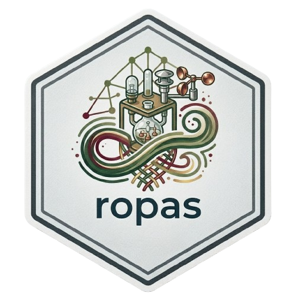

# ropas

R client for the [OPAS](https://opas.isprambiente.it) (OPen Air System)
REST API, maintained by ISPRA (Istituto Superiore per la Protezione e la
Ricerca Ambientale). Provides access to the Italian national air quality
monitoring network: station metadata, series catalogues, and hourly/daily
measurements with validity codes.

## Installation

```r
# install.packages("devtools")
devtools::install_github("jobonaf/ropas")
```

## Quick start

```r
library(ropas)

# Authenticate
opas_login("your@email.it", "yourpassword")

# Browse available series for Friuli-Venezia Giulia (ISTAT code "06")
serie <- opas_series(region = "06")
serie[, c("series_id", "station_name", "parameter_name", "parameter_unit")]

# Download the last 24 hours for a series
dati <- opas_get_data(series_id = 12900, last_hours = 24)

# Convert raw values to physical units
dati$value <- dati$value_raw * serie$parameter_conv_curr[
  serie$series_id == 12900
]

# Keep only valid data (post_validity_code == 0)
dati_validi <- dati[dati$post_validity_code == 0, ]
```

## Functions

| Function | Description |
|---|---|
| `opas_login(email, password)` | Authenticate and store JWT token |
| `opas_series(region, station)` | List available data series |
| `opas_get_data(series_id, ...)` | Download time series measurements |

Authentication is handled automatically: the token is refreshed
transparently before expiry (~1 hour), using the refresh token valid for
~24 hours. After 24 hours a new `opas_login()` is required.

## Retrieving data

`opas_get_data()` supports three retrieval modes:

```r
# Last N hours (raw hourly data)
opas_get_data(series_id, last_hours = 24)

# Last N days (daily aggregates)
opas_get_data(series_id, last_days = 30)

# Custom range — ISO 8601 strings or POSIXct objects
opas_get_data(series_id,
              start = "2026-01-01T00:00:00",
              end   = "2026-03-31T23:59:59")

# Custom range — daily aggregates
opas_get_data(series_id,
              start = "2026-01-01T00:00:00",
              end   = "2026-03-31T23:59:59",
              daily = TRUE)
```

The returned tibble includes context columns (`station_name`,
`parameter_name`, `parameter_unit`) alongside the measurements, so it is
self-contained without further joins.

## Validity codes

The `post_validity_code` column is the primary filter for data quality:

| Code | Meaning |
|---:|---|
| 0 | Valid |
| 1 | Reconstructed |
| -1 | Suspect |
| < -1 | Invalid (various causes) |

See `?opas_get_data` for the full table of `measure_code`,
`auto_validity_code`, and `final_validity_code`.

## Measurement values

`value_raw` contains raw instrument values as returned by the API.
Multiply by `parameter_conv_curr` (from `opas_series()`) to obtain values
in the physical unit reported in `parameter_unit`.

Example for O3: `parameter_conv_curr = 2` converts ppb → µg/m³.

## Timestamps

`datetime` is parsed as UTC+1 fixed (`"Etc/GMT-1"`), consistent with the
legal reference time prescribed by D.Lgs. 155/2010 and EU Directive
2024/2881 for Italian air quality data. The OPAS server returns timestamps
without an explicit timezone offset; this interpretation is based on
empirical checks and has not been formally confirmed by ISPRA developers.

## Region ISTAT codes

Only regions with at least one station currently in OPAS are listed.

| Code | Region |
|---:|---|
| 02 | Valle d'Aosta |
| 04 | Trentino Alto Adige |
| 05 | Veneto |
| 06 | Friuli-Venezia Giulia |
| 07 | Liguria |
| 08 | Emilia-Romagna |
| 09 | Toscana |
| 10 | Umbria |
| 11 | Marche |
| 12 | Lazio |
| 13 | Abruzzo |
| 15 | Campania |
| 16 | Puglia |

## License

GPL-3. See [LICENSE](LICENSE) for the full text.